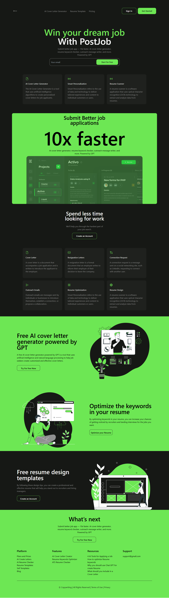

# PostJob | AI Cover Letter Generator & Resume Template



[](https://developer.mozilla.org/en-US/docs/Web/HTML)
[](https://tailwindcss.com/)
[](https://developer.mozilla.org/en-US/docs/Web/JavaScript)

A **responsive landing page** for PostJob, a platform that helps users create standout resumes and AI-generated cover letters. Built with **HTML, Tailwind CSS, and vanilla JavaScript**.

> **Design Credit:** The original design is from [UXKitZone Free Landing Page Collection](https://uxkitzone.com/preview-of-free-landing-page-collections-figma/).

## Live Demo

Check out the live version here:  
[**View Live Demo**](https://yourusername.github.io/postjob-landing-page/)

## Features

- Responsive navigation menu with mobile toggle
- Hero section with email input and CTA buttons
- Info cards highlighting core features:
  - AI Cover Letter Generator
  - Smart Personalization
  - Resume Scanner
- About section with platform benefits
- Interactive elements powered by vanilla JavaScript
- Footer with platform, features, resources, and support links

## Project Structure

```bash
postjob-landing-page/
├── index.html          # Main HTML file
├── css/
│   ├── input.css       # Tailwind CSS directives
│   └── output.css      # Compiled Tailwind CSS
├── js/
│   └── main.js         # JavaScript for menu toggle
├── assets/
│   └── images/         # All images used in the landing page
├── package.json        # Tailwind CLI setup
├── tailwind.config.js  # Tailwind configuration
└── README.md           # Project documentation
```

## Technologies Used

- **HTML5** – Semantic markup for accessible content
- **Tailwind CSS v3** – Utility-first CSS framework for styling
- **Vanilla JavaScript** – Menu toggle and interactive elements
- **PostCSS / Tailwind CLI** – For building CSS

## Installation & Usage

1. **Clone the repository**

```bash
git clone https://github.com/Winnie-Waiguru/postjob-landing-page.git
cd postjob-landing-page

```

2. **Install dependencies**

```bash
npm install
```

3. **Build Tailwind CSS**

```bash
npx tailwindcss -i ./css/input.css -o ./css/output.css --watch
```

3. **Open the project in your browser**

```bash
Open index.html directly or serve using Live Server in VS Code.
```

## How it works

- Tailwind CSS handles all styling using utility classes.
- JavaScript in main.js toggles the mobile menu open and close.
- Layout is fully responsive across desktop, tablet, and mobile screens.

## Credits

- **Design Credit:** [UXKitZone Free Landing Page Collection](https://uxkitzone.com/preview-of-free-landing-page-collections-figma/).
- **Icons:** [Heroicons](https://heroicons.com/).
- **Images:** Stored in the assets/images folder.

## License

This project is for **educational and portfolio purposes** only. Design credit belongs to **UXKitZone**.
